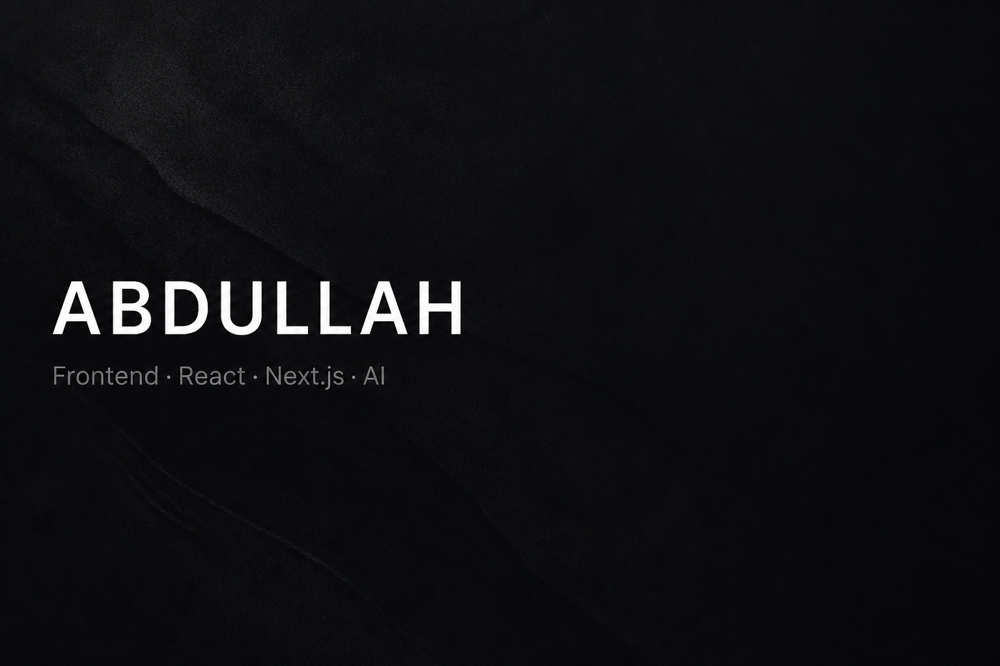

  

  I ship interfaces people actually finish using. 
  <b>React</b> · <b>Next.js</b> · TypeScript — plus AI when it saves someone a step.

  Frontend at Innostax · Open to relocation 
  <a href="https://abdullahsidd.vercel.app">site</a>
  ·
  <a href="https://www.linkedin.com/in/abdtriedcoding">linkedin</a>
  ·
  <a href="mailto:siddabdullah46@gmail.com">email</a>

---

### Built in public

**[NotesGPT](https://notessgpt.vercel.app)** — speak, get a summary and a to-do list.  
[live](https://notessgpt.vercel.app) · [source](https://github.com/abdtriedcoding/notesgpt)

**[Noted](https://notedwebapp.vercel.app)** — a Notion-style workspace that lives in the browser.  
[live](https://notedwebapp.vercel.app) · [source](https://github.com/abdtriedcoding/noted)

  TypeScript · React · Next.js · Tailwind · Convex · Vercel

